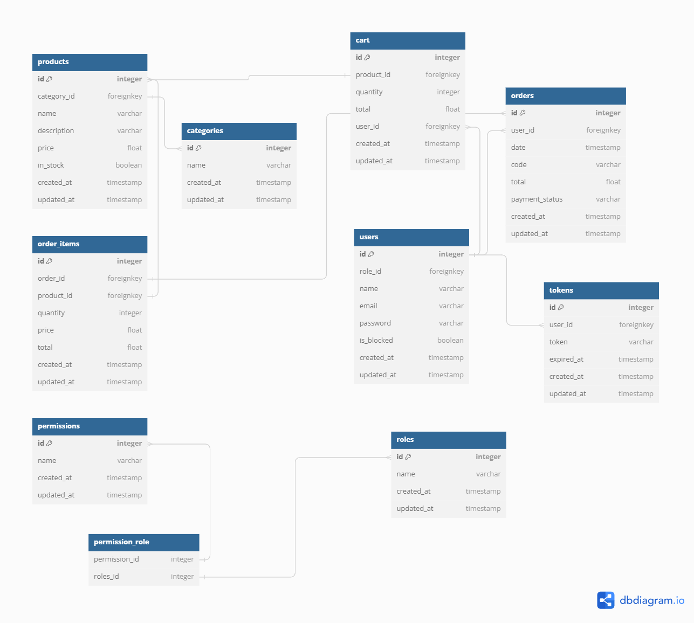

# API Documentation

## Overview
The following is the Shop API Documentation with Express.Js
The system I created has 2 roles, namely:
- Seller (Only has 1 Seller)
- Regular User

Table Relations


## Installation
For Instalation Project:
- Clone This Repository
```
https://github.com/purwoceng/Express-shop.git
```
- After successful Clone then go to the Project folder
```
cd Express-Shop
```
- After that to install all Dependencies do the command:
```
npm install
```
- If you have to migrate the database that has been created in the Prisma schema:
``` 
npx prisma migrate dev
```
Table Migrate Result:


## Usage
- To run it, please type the code:
```
npm start
```
- From this project I created 3 data seeders, namely:
  - authorization.jsn(to create faker role and permission data)
      - Role Seller Permission
      

      - Role Regular User Permission
      
    to run the authorization.js seeder with the command
    ```
    node database/authorization.js
    ```
  - products.js (to create faker product data)
    Before running seeders products.js we have to fill in the categories table first
    ### `POST /categories`
    Description: Creates a new category.
    #### Request Body
    - `name`: The name of the categories.
    #### Example
      ```json
      {
        "name": "Makanan"
      }
      ```

       - to run the products.js seeder with the command
        ```
        node database/products.js
        ```
      - Result of the products.js
      

  - user.js (to create faker user data)
      - to run the users.js seeder with the command
        ```
        node database/users.js
        ```
      

## Endpoints
List all Endpoint Express Shopping Cart:


### `POST /users`
Description: Retrieves information about the authenticated user.

#### Example

### `POST /users`
Description: Creates a new user.

#### Request Body
- `name`: The name of the user.
- `email`: The email address of the user.
- `password`: The password of the user.

#### Example
```json
{
  "name": "Purwoceng",
  "email": "purwoceng@gmail.com",
  "password": "password123"
}
```
## Response
```json
{
  "message": "success add to users",
  "user": {
    "id": 6,
    "email": "purwoceng@gmail.com",
    "name": "Purwoceng",
    "password": "$2b$04$SMWQOObVhChGXGCw3xQVq.9FPBnHVRhvcS9tS63T16BmpikpWns0y",
    "is_blocked": false,
    "role_id": 2,
    "created_at": "2024-02-17T16:28:16.522Z",
    "updated_at": "2024-02-17T16:28:16.522Z"
  }
}
```

- After Register/Post Users Data, you can login with your email and password
## Endpoints
### `POST /login`
## Example
```json
{
  "email": "purwoceng@gmail.com",
  "password": "password123"
}
```
### Response
```json
  {
  "token": "Nvu+SSF2UewvAe86gNLexEf5Kf0ORweKjVs4KVJoJvKzmtOertwqRorZo8O+VQOaxBIhHf6f4Ku28RP0rFQ9+A==",
  "user": {
    "id": 6,
    "email": "purwoceng@gmail.com",
    "name": "Purwoceng"
  }
}
```

- and we will get a token after we log in and the token will be stored in the tokens table


- after that we have to fill in the body Headers

  ```json
  {
    "authorization": "Nvu+SSF2UewvAe86gNLexEf5Kf0ORweKjVs4KVJoJvKzmtOertwqRorZo8O+VQOaxBIhHf6f4Ku28RP0rFQ9+A=="
  }
  ```

## Endpoints
### `categories`
- Get all data Categories
  ### `GET /categories`
    ### Response

    ```json
      {
        "message": "Data Categories",
        "categories": [
          {
            "id": 1,
            "name": "Pakaian",
            "created_at": "2024-02-15T16:27:54.000Z",
            "updated_at": "2024-02-15T16:27:59.000Z"
          },
          {
            "id": 2,
            "name": "Makanan",
            "created_at": "2024-02-15T16:28:11.000Z",
            "updated_at": "2024-02-15T16:28:13.000Z"
          }
        ]
      }
    ```
- Get data Categories by ID
  ### `GET /categories/:id`
- Post Data Categories (Only Seller can use it)
  ### `POST /categories`
    ### Request Body
    ```json
      {
        "name": "Pakaian"
      }
    ```
- Put/Edit Data Categories (Only Seller can use it)
  ### `PUT /categories/:id`
- Delete Data Categories (Only Seller can use it)
  ### `DELETE /categories/:id`

### `products`
- Get all data Products
  ### `GET /products`
    #### Response
    ``` json
        {
        "message": "Data products",
        "products": [
          {
            "id": 2,
            "name": "Modern Soft Chips",
            "category_id": 1,
            "price": 687,
            "in_stock": false,
            "description": "Carbonite web goalkeeper gloves are ergonomically designed to give easy fit",
            "created_at": "2024-02-15T09:28:23.000Z",
            "updated_at": "2024-02-15T09:28:22.606Z",
            "category": {
              "name": "Pakaian"
            }
          },
        ]
        }
    ```
- Post data Products by ID (Only Seller can use it)
  ### `POST /products`
    ### Request Body
    ```json
      {
      "name": "Baju Koko",
      "category_id": 1,
      "price": 687,
      "in_stock": true,
      "description": "Carbonite web goalkeeper gloves are ergonomically designed to give easy fit"
      }
    ```
- Put/Edit data Products (Only Seller can use it)
  ### `PUT /products/:id`
- Delete Data Products (Only Seller can use it)
  ### `DELETE /products/:id`

### `cart`
- Get all data Cart
  ### `GET /cart`
- Post data Cart
  ### `POST /cart`
  #### Request Body
  ```json
    {
    "product_id": 2,
    "quantity": 1
    }
  ```
- Put/Edit data Cart
  ### `PUT /cart`
- Delete Data Cart
  ### `DELETE /cart`

### `order`
- Get all data Order
  ### `GET /order`
- Post data Order
  order here is moving all data from the contents of the cart into the order table and order items
  ### `POST /order`
- Put/Edit data Order
  ### `PUT /order`
- Delete Data Order
  ### `DELETE /order`
- Payment
  ### `POST /order/pay`
  #### Request Body
  ```json
    {
    "order_id": 1,
    "cardNumber": "4012888888881881",
    "cvv": 201,
    "expiryMonth": "02",
    "expiryYear": "2026"
    }
  ```

